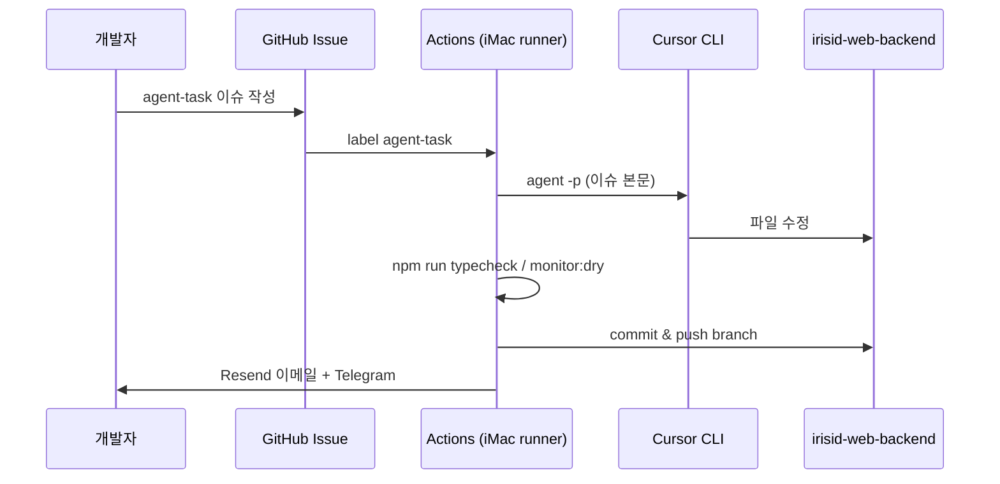

# Iris ID 자동화 — 2단계 아키텍처

## 개요

| 단계 | 어디서 | 역할 |
|------|--------|------|
| **1단계** | **Cursor IDE** (조종실) | 에이전트에게 작업 지시, 코드 작성·테스트, 수동 커밋/푸시 |
| **2단계** | **iMac / 서버 24/7** | GitHub Actions + self-hosted runner + Cursor CLI가 주기·이슈 기반으로 실행 |

Cursor 앱은 항상 켜 둘 필요가 없습니다. 24시간 돌아가는 것은 **GitHub Actions 워크플로**와 **iMac上的 runner**입니다.

---

## 흐름 A — GitHub Issue → Cursor CLI 에이전트



1. [New Issue → **Agent task**](https://github.com/hoyong-irisid/irisid-web-backend/issues/new?template=agent-task.yml) 또는 기존 이슈에 라벨 `agent-task` 추가  
2. 워크플로 [agent-from-issue.yml](../.github/workflows/agent-from-issue.yml) 실행  
3. Cursor CLI가 이슈 내용대로 코드 수정 (git은 CI가 담당)  
4. 테스트 (`typecheck`, `monitor:dry`)  
5. `agent/issue-N-…` 브랜치로 커밋·푸시  
6. Resend + Telegram으로 결과 알림  

---

## 흐름 B — 매일 사이트 모니터링

워크플로 [daily-monitor.yml](../.github/workflows/daily-monitor.yml) (cron 08:00 UTC):

- 페이지 헬스, 깨진 링크, 폼 검사  
- 문제 있으면 GitHub Issue 생성  
- Resend 일일 리포트 + Telegram  

동일한 **self-hosted runner (iMac)** 에서 실행하는 것을 권장합니다 (Playwright·네트워크 안정).

---

## iMac self-hosted runner 설치

### 1. GitHub에서 runner 등록

`hoyong-irisid/irisid-web-backend` → **Settings → Actions → Runners → New self-hosted runner** → macOS 선택.

라벨에 반드시 포함:

- `self-hosted`
- `irisid-imac`

### 2. iMac에서 runner 설치 (한 번)

```bash
# GitHub 안내에 나온 mkdir/download/config.sh 명령을 따른 뒤:
./config.sh --url https://github.com/hoyong-irisid/irisid-web-backend --token <TOKEN> --labels self-hosted,irisid-imac

# 서비스로 등록 (재부팅 후에도 실행)
./svc.sh install
./svc.sh start
```

또는 저장소의 안내 스크립트:

```bash
bash scripts/setup-self-hosted-runner-mac.sh
```

### 3. iMac에 미리 설치 권장

| 도구 | 용도 |
|------|------|
| Node.js 22+ | `npm ci`, 모니터 |
| Git, GitHub CLI (`gh`) | 이슈 조회·댓글 |
| (선택) Cursor CLI | runner에서 재설치해도 됨 — 워크플로가 `install-cursor-cli.sh` 실행 |

### 4. iMac 절전 끄기

**시스템 설정 → 에너지**에서 절전 비활성화 또는 `caffeinate`로 Actions 대기 중 깨어 있게 유지.

---

## GitHub Secrets / Variables

### Secrets

| 이름 | 용도 |
|------|------|
| `CURSOR_API_KEY` | [Cursor Dashboard](https://cursor.com/settings) API 키 — CLI 인증 |
| `RESEND_API_KEY` | 일일·워크플로 리포트 이메일 |
| `TELEGRAM_BOT_TOKEN` | Telegram 봇 |
| `TELEGRAM_CHAT_ID` | 알림 받을 채팅 ID |

`GITHUB_TOKEN`은 Actions가 자동 제공 (이슈·푸시 권한은 workflow `permissions` 참고).

### Variables

| 이름 | 예시 |
|------|------|
| `REPORT_EMAIL_FROM` | `Iris ID Bot <monitor@mail.irisid.com>` |
| `REPORT_EMAIL_TO` | `you@irisid.com` |
| `SITE_URL` | `https://irisid.com` |

```bash
gh secret set CURSOR_API_KEY --repo hoyong-irisid/irisid-web-backend
gh variable set REPORT_EMAIL_FROM --repo hoyong-irisid/irisid-web-backend --body "Iris ID Monitor <monitor@yourdomain.com>"
```

---

## 1단계 — Cursor IDE에서 할 일

- 모니터링 규칙·스크립트 개발 (`config/monitor.json`, `src/`)  
- `npm run monitor:dry` 로 로컬 검증  
- 만족하면 **직접** `git commit` / `git push` (조종실)  
- 운영 자동화는 2단계에 맡김  

---

## runner가 없을 때

워크플로 `runs-on`을 임시로 `ubuntu-latest`로 바꿀 수 있으나:

- Playwright·사이트 406/봇 차단 이슈 가능  
- Cursor CLI는 공식 install 스크립트로 설치  

**운영 환경 = iMac self-hosted** 를 기준으로 설계했습니다.

---

## 관련 파일

| 파일 | 설명 |
|------|------|
| `.github/workflows/agent-from-issue.yml` | Issue → Cursor CLI |
| `.github/workflows/daily-monitor.yml` | 매일 모니터 |
| `scripts/ci/*` | CLI 설치, 에이전트, 테스트, 커밋, 알림 |
| `AGENTS.md` | Cursor 에이전트용 저장소 가이드 |
